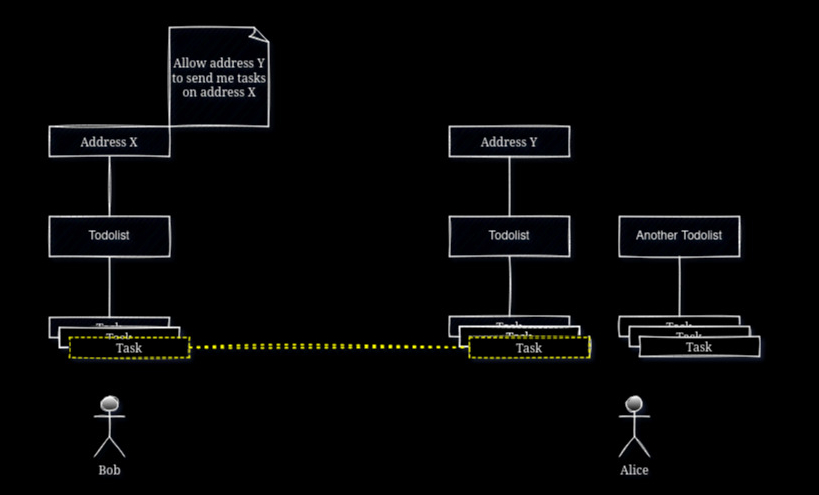

# ICBTask Documentation

## Get started

You only need to:
1. Create an account and generate an **API Key** [here](https://icbtask.com/signup)
2. Download ICBTask official cli [here](https://github.com/icbtask/cli)

You're ready to go !

## Terminology
### Todolist
- You can create max **20** todolists.
- A todolist can contains any number of tasks.

### Task
- You can create max **256** tasks.
- To keep things simple, a task has two fields: `project` and `description`

### Address
- An `address` is a random 52 characters.
- You can create max **20** addresses.
- They are not sensitive data, you can share them publicly, that's fine.
- You can attach multiple addresses to a single todolist.
- You can attach a specific address to only one todolist.
- For each address you define what are the other addresses that are allowed to send you tasks
- You only need to have address(es) when you need to send or receive tasks from someones else

Check out ICBTask official cli to learn more about how to manage your tasks/todolists/addresses 👉 [here](https://github.com/icbtask/cli)
## Typical use case
<div align="center">
<p align="cetner">
  </img>
</p>
</div>

## Task sharing

### Rules for sharing tasks
- You can receive tasks only from addresses that you explicitly allow.
- You need to attach an address to a todolist first before you can receive tasks on that address

### Example
#### Sharing your task(s) with someone
1. You need to create an address
```
$ icbtask address add
```
2. Attach the address to a todolist
```
$ icbtask address attach --address=<your address> --todolist-id=<your todolist id>
```
3. The remote address SHOULD allow you to send it tasks
```
$ icbtask task share --id=<task id> --remote-address=<remote_address>
```

#### Receive task(s) from someone
1. You need an address that is attached to a todolist
```
$ icbtask address attach --address=<your address> --todolist-id=<your todolist id>
```
2. allow the remote address to send you tasks
```
$ icbtask address allow --address=<your address> --remote-address=<remote address>
```

## API Documentation
Check the API documentation [here](/api/)
